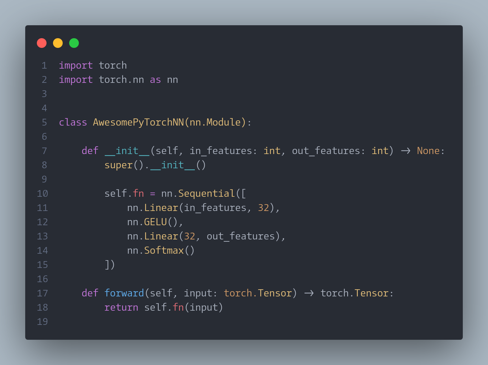
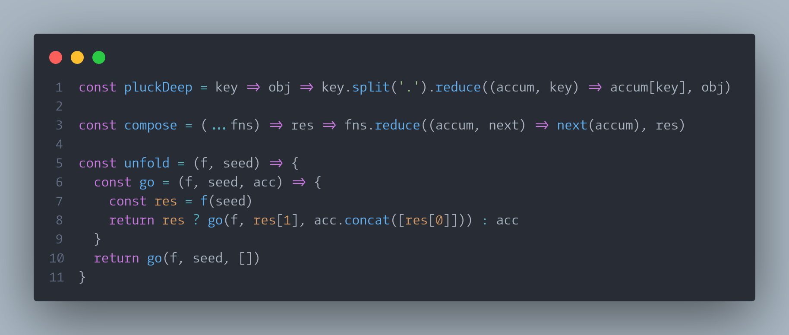

# Liga CamingoCode

Just a ligaturized version of the [CamingoCode](https://www.fontsquirrel.com/fonts/camingocode) font.

## What Am I Getting?

### Python



### JavaScript



## How Do I Get The Fonts?

You can download a zip file from the releases.

If you are on linux you can install the font as follows:

```sh
cd /usr/share/fonts
sudo mkdir custom_fonts && cd custom_fonts
sudo unzip /path/to/ligacamingocode.zip
sudo fc-cache -fv
```

## Special Thanks To

1. [ToxicFrog / Ligaturizer](https://github.com/ToxicFrog/Ligaturizer), for providing the code used to ligaturize this fonts.
2. [ tonsky / FiraCode ](https://github.com/tonsky/FiraCode), for creating the awesome ligaturized FiraCode font where we obtained our ligatures.
3. [Font Squirrel](https://www.fontsquirrel.com/fonts/camingocode), for providing the actual CamingoCode font.
